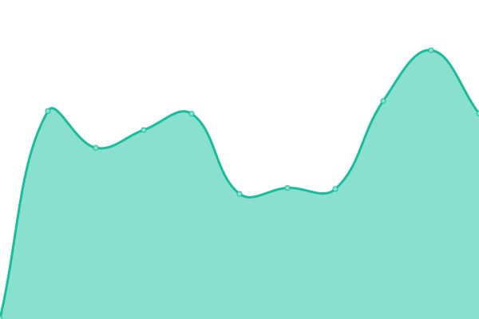
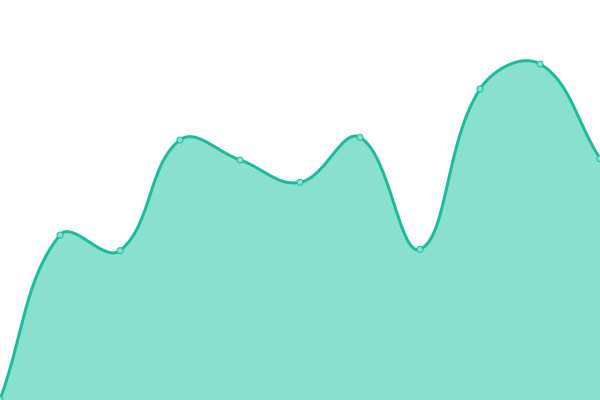

# [📈 Live Status](https://huskar-org.github.io/uptime): <!--live status--> **🟨 Partial outage**

This repository contains the open-source uptime monitor and status page for [Huskar](https://huskar.org), powered by [Upptime](https://github.com/upptime/upptime).

With [Upptime](https://upptime.js.org), you can get your own unlimited and free uptime monitor and status page, powered entirely by a GitHub repository. We use [Issues](https://github.com/huskar-org/uptime/issues) as incident reports, [Actions](https://github.com/huskar-org/uptime/actions) as uptime monitors, and [Pages](https://huskar-org.github.io/uptime) for the status page.

<!--start: status pages-->
<!-- This summary is generated by Upptime (https://github.com/upptime/upptime) -->
<!-- Do not edit this manually, your changes will be overwritten -->

| URL                                            | Status  | History                                                                                                        | Response Time                                                                            | Uptime                                                                                                                                                                                                                                     |
| ---------------------------------------------- | ------- | -------------------------------------------------------------------------------------------------------------- | ---------------------------------------------------------------------------------------- | ------------------------------------------------------------------------------------------------------------------------------------------------------------------------------------------------------------------------------------------ |
| [Huskar Console Demo](https://demo.huskar.org) | 🟩 Up   | [huskar-console-demo.yml](https://github.com/huskar-org/uptime/commits/master/history/huskar-console-demo.yml) |  773ms |  |
| [Huskar API Demo](https://api.demo.huskar.org) | 🟥 Down | [huskar-api-demo.yml](https://github.com/huskar-org/uptime/commits/master/history/huskar-api-demo.yml)         |  863ms     |            |

<!--end: status pages-->

[**Visit our status website →**](https://huskar-org.github.io/uptime)

## 📄 License

- Code: [MIT](./LICENSE) © [Huskar](https://huskar.org)
- Data in the `./history` directory: [Open Database License](https://opendatacommons.org/licenses/odbl/1-0/)
